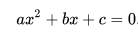
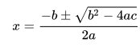

# Rootish数组栈(Rootish Array Stack)


*Rootish Array Stack* 是一种基于有序数组的结构，可最大限度地减少浪费的空间（基于[高斯求和技术](https://betterexplained.com/articles/techniques-for-adding-the-numbers-1-to-100/)）。一个*Rootish Array Stack*由一个数组组成，该数组保存许多固定大小数组，这些数组的大小逐渐递增。


可调整大小数组保存对块（固定大小数组）的引用。块的容量与可调整大小数组中的索引相同。块不像常规Swift数组那样可增长/缩小。相反，当达到可调整大小数组的容量时，会创建一个稍大的新块。当块被清空时，最后一个块被释放。这是对Swift数组在浪费空间方面所做的很大改进。


这边，您可以看到插入/删除操作的行为（非常类似于Swift数组处理插入/删除操作的方式）。


## 高斯求和技巧


著名数学家[卡尔·弗里德里希·高斯](https://en.wikipedia.org/wiki/Carl_Friedrich_Gauss)最着名的传说之一，可以追溯到他上小学时。 有一天，高斯的老师要求他的班级同学求从1加100所有数字的和，老师原本认为这项任务需要足够长的时间，可以让他走出去休息一下。当年轻的高斯举手回答`5050`时，老师很震惊。 真快？ 老师怀疑作弊，但没有。 高斯找到了一个公式来避免手动将所有数字一个一个的相加。他的公式：

```
sum from 1...n = n * (n + 1) / 2
```
为了理解这个想象中的`n`块，来看一个例子，假设`n`为`5`，其中`x`代表`1`个单元：

```
blocks:     [x] [x x] [x x x] [x x x x] [x x x x x]
# of x's:    1    2      3        4          5
```
*block*`1`有1个`x`，*block*`2`为2`x`，*block*`3`有3`x`，。。。

如果现在想得到所有`1`到`n`块的和，可以通过简单地一个一个相加来计算。 这没关系，但对于大量的块可能需要很长时间！ 然而，您可以将块排列为如下 _半金字塔_ 结构：

```
# |  blocks
--|-------------
1 |  x
2 |  x x
3 |  x x x
4 |  x x x x
5 |  x x x x x

```
然后我们镜像 _半金字塔_  ，并重新排列镜像，使其与初始_半金字塔_相匹配形成一个矩形结构：

```
x                  o      x o o o o o
x x              o o      x x o o o o
x x x          o o o  =>  x x x o o o
x x x x      o o o o      x x x x o o
x x x x x  o o o o o      x x x x x o
```
现在我们有 `n` 行和 `n + 1` 列：_5行和6列_。

我们可以像计算矩形面积一样计算和！ 让我们用`n`表示宽度和高度：

```
area of a rectangle = height * width = n * (n + 1)
```
我们只想计算`x`的数量，而不是`o`的数量。 由于`x`和`o`之间的比例为 1：1，我们可以将这个面积除以2！

```
area of only x = n * (n + 1) / 2
```
瞧！ 一个超快速的方法来获取所有块元素的总和！ 该等式对于快速导出`block`和`inner block index`方程非常有用。
<!-- TODO: Define block and innerBlockIndex -->

## Get/Set


接下来，我们希望找到一种有效且准确的方法来访问随机索引处的元素。 例如，`rootishArrayStack[12]`指向哪个块？ 要回答这个问题，我们需要学习更多数学！

确定内部块`index`比较容易。 如果`index`在某个`block`中，那么：

```
inner block index = index - block * (block + 1) / 2
```
确定索引指向哪个`block`比较困难。 请求元素的元素数量为：`index + 1`元素。 块`0...block`中的元素数是 `(block + 1) * (block + 2) / 2` （上面导出的等式）。 `block`和`index`之间的关系如下：

```
(block + 1) * (block + 2) / 2 >= index + 1
```
可以重写为：

```
(block)^2 + (3 * block) - (2 * index) >= 0
```
使用解一元二次方程公式，可以得到：

```
block = (-3 ± √(9 + 8 * index)) / 2
```
> **译注：** 这是维基百科 [一元二次方程公式](https://en.wikipedia.org/wiki/Quadratic_formula)，此处的`index`是常量。
>
> 二次方程:
>
> 
>
> 求`x`的公式：
>
> 

此处负数没有意义，所以我们采用正根。 通常，此解决方案不是整数。 然而，回到我们的不等式，我们想要最小的块，例如`block => (-3 + √(9 + 8 * index)) / 2`。 接下来，我们取结果的上限：

```
block = ⌈(-3 + √(9 + 8 * index)) / 2⌉
```

现在我们可以弄清楚`rootishArrayStack[12]`指向的是什么！ 首先，让我们看看`12`指向哪个块：

```
block = ⌈(-3 + √(9 + 8 * (12))) / 2⌉
block = ⌈(-3 + √105) / 2⌉
block = ⌈(-3 + (10.246950766)) / 2⌉
block = ⌈(7.246950766) / 2⌉
block = ⌈3.623475383⌉
block = 4
```
然后，看看在对应块中的索引：

```
inner block index = (12) - (4) * ((4) + 1) / 2
inner block index = (12) - (4) * (5) / 2
inner block index = (12) - 10
inner block index = 2
```
因此，`rootishArrayStack[12]`指向索引为`4`的块和内部块索引`2`。


### 有趣的发现


使用`block`方程，我们可以看到`blocks`的数量与元素数量的平方根成正比：**O(blocks) = O(√n)**.  


## 实现细节

让我们从实例变量和结构声明开始：

```swift
import Darwin

public struct RootishArrayStack<T> {

  fileprivate var blocks = [Array<T?>]()
  fileprivate var internalCount = 0

  public init() { }

  var count: Int {
    return internalCount
  }

  ...

}

```
元素是泛型`T`，因此任何类型的数据都可以存储在列表中。 `blocks`是一个可调整大小的数组，用于保存类型为`T?`的固定大小数组。


> 固定大小数组采用类型`T?`的原因是，对元素的引用在删除后不会保留。例如：如果删除最后一个元素，则必须将最后一个索引设置为`nil`，以防止最后一个元素在内存被访问。


`internalCount`是一个内部可变计数器，用于跟踪元素的数量。 `count`是一个只读变量，它返回`internalCount`值。 这里引入了`Darwin`来提供简单的数学函数，例如`ceil()`和`sqrt()`。

结构体的`capacity`就是高斯求和：

```swift
var capacity: Int {
  return blocks.count * (blocks.count + 1) / 2
}
```

接下来，让我们看看我们将如何`get`和`set`元素：

```swift
fileprivate func block(fromIndex: Int) -> Int {
  let block = Int(ceil((-3.0 + sqrt(9.0 + 8.0 * Double(index))) / 2))
  return block
}

fileprivate func innerBlockIndex(fromIndex index: Int, fromBlock block: Int) -> Int {
  return index - block * (block + 1) / 2
}

public subscript(index: Int) -> T {
  get {
    let block = self.block(fromIndex: index)
    let innerBlockIndex = self.innerBlockIndex(fromIndex: index, fromBlock: block)
    return blocks[block][innerBlockIndex]!
  }
  set(newValue) {
    let block = self.block(fromIndex: index)
    let innerBlockIndex = self.innerBlockIndex(fromIndex: index, fromBlock: block)
    blocks[block][innerBlockIndex] = newValue
  }
}
```
`block(fromIndex:)`和 `innerBlockIndex(fromIndex:, fromBlock:)` 分别是我们之前导出的 `block` 和 `inner block index` 方程。 `superscript`（下标）让我们方便地使用用熟悉的`[index:]`语法对结构体进行`get`和`set`访问。 对于`superscript`中的`get`和`set`，我们使用相同的逻辑：

1. 确定索引指向的块
2. 确定内部块索引
3. `get` /`set`这个值

> **译注：** 下标 (subscripts)是Swift提高的有一种便捷访问方式，在类(class)、结构体(structure)和枚举(enumeration)中都可以使用，而且可以定义多个下标，具体可查看[官方手册](https://docs.swift.org/swift-book/LanguageGuide/Subscripts.html)

接下来，让我们看看我们将如何`growIfNeeded()`和`shrinkIfNeeded()`。

```swift
fileprivate mutating func growIfNeeded() {
  if capacity - blocks.count < count + 1 {
    let newArray = [T?](repeating: nil, count: blocks.count + 1)
    blocks.append(newArray)
  }
}

fileprivate mutating func shrinkIfNeeded() {
  if capacity + blocks.count >= count {
    while blocks.count > 0 && (blocks.count - 2) * (blocks.count - 1) / 2 >    count {
      blocks.remove(at: blocks.count - 1)
    }
  }
}
```

如果我们的数据增大或缩小，也希望我们的数据结构适应变化。就像Swift数组一样，当容量达到阈值时，我们将使用`grow`或`shrink`修改结构体的大小。 对于Rootish数组堆栈，在`insert`操作，如果倒数第二个块中已满就要`grow`；如果最后两个块为空，则`shrink`。

现在来到比较熟悉的Swift数组操作。

```swift
public mutating func insert(element: T, atIndex index: Int) {
	growIfNeeded()
	internalCount += 1
	var i = count - 1
	while i > index {
		self[i] = self[i - 1]
		i -= 1
	}
	self[index] = element
}

public mutating func append(element: T) {
	insert(element: element, atIndex: count)
}

public mutating func remove(atIndex index: Int) -> T {
	let element = self[index]
	for i in index..<count - 1 {
		self[i] = self[i + 1]
	}
	internalCount -= 1
	makeNil(atIndex: count)
	shrinkIfNeeded()
	return element
}

fileprivate mutating func makeNil(atIndex index: Int) {
  let block = self.block(fromIndex: index)
  let innerBlockIndex = self.innerBlockIndex(fromIndex: index, fromBlock: block)
  blocks[block][innerBlockIndex] = nil
}
```
 `insert(element:, atIndex:)` 中，我们将`index`之后的所有元素向右移动1位。使用`subscript`方式，移动元素，为要插入的元素创建空间。

`append(element:)`只是非常方便的`insert`到最后。

对于`remove(atIndex:)`，我们将`index`之后的所有元素向左移动1位。之后将结构体中的最后一个值设置为`nil`。

`makeNil(atIndex:)`使用与`subcript`相同的逻辑，只是将特定索引的元素设置为`nil`。

<!--

> 将选项值设置为“nil”与将其包装值设置为“nil”不同。 optionals包装值是可选引用中的嵌入类型。这意味着`nil`包装的值实际上是`.some（.none）`而将根引用设置为`nil`是`.none`。为了更好地理解Swift选项，我建议查看@ SebastianBoldt的文章[Swift! Optionals?](https://medium.com/ios-os-x-development/swift-optionals-78dafaa53f3#.rvjobhuzs)。

-->

## 性能

* 内部计数器跟踪结构体中的元素数量。 `count`在**O(1)**时间执行。

* `capacity`可以使用高斯求和来计算，需要**O(1)**时间来执行。

* 由于`subcript[index:]`使用`block`和`inner block index`方程式，可以在**O(1)**时间内执行，所有get和set操作都是**O(1)**。

* 忽略`grow`和`shrink`的时间成本，`insert(atIndex:)`和`remove(atIndex:)`操作会移动指定索引的所有元素，导致**O(n)**时间。


## 生长与缩小的分析


性能分析没有考虑`grow`和`shrink`的成本。 与常规的Swift数组不同，`grow`和`shrink`操作不会将所有元素复制到备份数组中。 它们只分配或释放与`blocks`数量成比例的数组。 `blocks`的数量与元素数量的平方根成比例。 增长和缩小只需要成本 **O(√n)**。

## 浪费的空间
Wasted space is how much memory with respect to the number of elements `n` is unused. The Rootish Array Stack never has more than 2 empty blocks and it never has less than 1 empty block. The last two blocks are proportional to the number of blocks, which is proportional to the square root of the number of elements. The number of references needed to point to each block is the same as the number of blocks. Therefore, the amount of wasted space with respect to the number of elements is **O(√n)**.

浪费的空间是关于元素数量n的未使用的内存量。 Rootish Array Stack永远不会有超过2个空块，并且它永远不会有少于1个空块。 最后两个块与块的数量成比例，这与块的数量的平方根成比例。 指向每个块所需的引用数与块数相同。 因此，相对于元素数量的浪费空间量是 **O(√n)**。


参考： [OpenDataStructures.org](http://opendatastructures.org)_

*作者：BenEmdon*  
*翻译：[Andy Ron](https://github.com/andyRon)*  
*翻译：[Andy Ron](https://github.com/andyRon)*  

